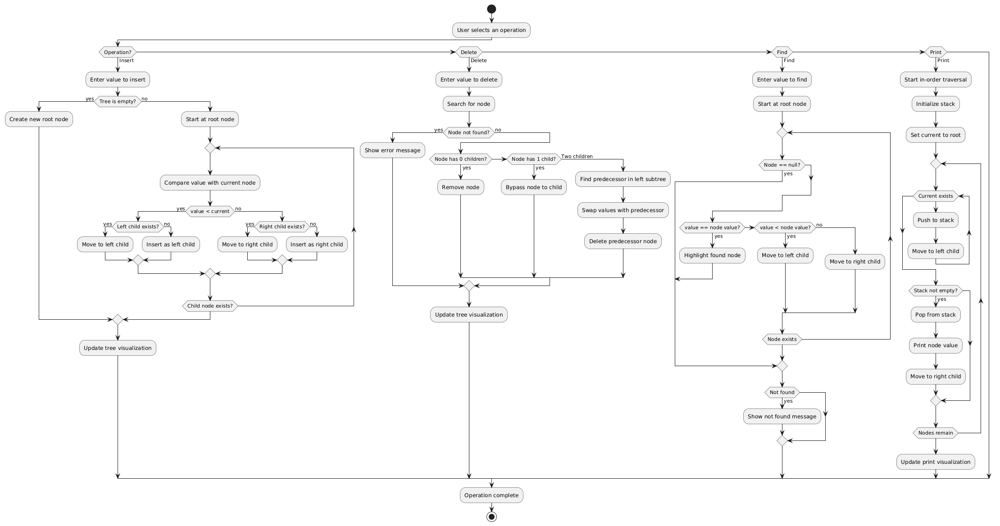

# Tree_project
virsulization of tree || DSA project 

# Binary Search Tree [BST](https://projectnull0.github.io/Tree_project/BST.html) 

 

# Red/Black Tree [RBT](https://projectnull0.github.io/Tree_project/RedBlack.html)

# Dijkstra's Shortest Path [click](https://projectnull0.github.io/Tree_project/Dijkstra.html)

# B-Tree  [Click](https://projectnull0.github.io/Tree_project/BTree.html)

AVL Tree [Click](https://projectnull0.github.io/Tree_project/AVLtree.html)

